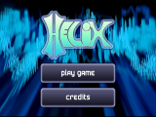
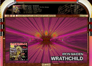
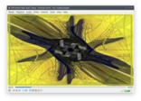

 [Chat with us on Discord](https://discord.gg/N9DyQfCH4j)

## projectM - The most advanced open-source music visualizer

**Experience psychedelic and mesmerizing visuals by transforming music into equations that render into a limitless array
of user-contributed visualizations.**

projectM is an open-source project that reimplements the
esteemed [Winamp Milkdrop](https://en.wikipedia.org/wiki/MilkDrop) by Geiss in a more modern, cross-platform reusable
library.

Its purpose in life is to read an audio input and to produce mesmerizing visuals, detecting tempo, and rendering
advanced equations into a limitless array of user-contributed visualizations.

### Important: This repository only contains libprojectM for use in application development!

This repository now only contains the projectM shared/static library. All frontends, plug-ins and other tools were
outsourced into separate repositories. If you're not a developer and just look for a download to run projectM visuals on
your machine or device, please use one of the links listed below. The releases section in this repository only contains
source-code and binary releases of the projectM development libraries and headers, which aren't useful for end users.

### End-User Applications

**Important**: projectM is currently undergoing heavy development. The available end-user frontends are
development previews, which are not feature-complete and may have bugs.

#### Windows

- Standalone ([projectMSDL 2.0 pre-release](https://github.com/projectM-visualizer/frontend-sdl-cpp/releases))
- [Steam](https://store.steampowered.com/app/1358800/projectM_Music_Visualizer/) (Same as standalone development
  preview)
- [Windows Store](https://www.microsoft.com/store/apps/9NDCVH0VCWJN) (Old 3.1.12 release)

#### macOS

- Standalone
  - [C++ app pre-release](https://github.com/projectM-visualizer/frontend-sdl-cpp/releases)
  - [Rust app development preview (signed)](https://github.com/projectM-visualizer/frontend-sdl-rust/releases/tag/v0.1.0)
- [Steam](https://store.steampowered.com/app/1358800/projectM_Music_Visualizer/) (Old 3.1.12 release)
- Music.app Plugin  (currently only available as an
  _unsigned_ [development preview](https://github.com/kblaschke/frontend-music-plug-in/releases/tag/v3.0-pre1))
- [Brew](https://formulae.brew.sh/formula/projectm) (Old 3.1.12 release)

#### Linux

- Standalone ([projectMSDL 2.0 pre-release](https://github.com/projectM-visualizer/frontend-sdl-cpp/releases), also
  available as `.deb` and `.tar.gz`)
- [Steam](https://store.steampowered.com/app/1358800/projectM_Music_Visualizer/) (Same as standalone development
  preview)

Or check your distribution's package manager for a binary release. If it is outdated, please contact the package
maintainer, as the projectM development team does not maintain any of the distribution-specific packages.

#### Android

- [Google Play](https://play.google.com/store/apps/details?id=com.psperl.prjM)

**Note**: Both the free and paid apps plus the Android TV app are _not_ created or supported by the projectM developers!
If you have technical troubles or other inquiries, please contact the app author via the means provided in the Play
Store. Any bug reports in the projectM issue tracker regarding the apps will be closed immediately.

#### Xbox / Windows Phone

- [Windows Store](https://www.microsoft.com/store/apps/9NDCVH0VCWJN) (Old 3.1.12 release)

#### Other

Source code and other resources, mostly aimed at developers.

- [Library source code](https://github.com/projectM-visualizer/projectm/) (this repository)
- [GStreamer plugin](https://github.com/projectM-visualizer/gst-projectm/)
- [Qt](https://www.qt.io/) based (Qt5/Qt6) desktop apps for Linux with
  [PipeWire](https://pipewire.org/), [PulseAudio](https://www.freedesktop.org/wiki/Software/PulseAudio/) and JACK audio
  backends ([source code](https://github.com/projectM-visualizer/frontend-qt), requires libprojectM 4.x).
- [ALSA, XMMS, Winamp, JACK](https://sourceforge.net/projects/projectm/files/) (legacy 2.x sources for historic
  purposes, unmaintained since 2012)

### Discord chat

[Chat with us on Discord!](https://discord.gg/N9DyQfCH4j)

### Click For Demo Videos

### Presets

The preset files define the visualizations via pixel shaders and Milkdrop-style equations and parameters.

The projectM library does not ship with any presets. The frontends come with varying preset packs which can be found in
separate repositories in the projectM repository list:

- [Base Milkdrop texture pack](https://github.com/projectM-visualizer/presets-milkdrop-texture-pack) - Recommended for
  use with _any_ preset pack!
- [Cream of the Crop Pack](https://github.com/projectM-visualizer/presets-cream-of-the-crop) - A collection of about 10K
  presets compiled by Jason Fletcher. Currently, projectM's default preset pack.
- [Classic projectM Presets](https://github.com/projectM-visualizer/presets-projectm-classic) - A bit over 4K presets
  shipped with previous versions of projectM.
- [Milkdrop 2 Presets](https://github.com/projectM-visualizer/presets-milkdrop-original) - The original preset
  collection shipped with Milkdrop and Winamp.
- [En D Presets](https://github.com/projectM-visualizer/presets-en-d) - About 50 presets created by "En D".

Included with projectM are the bltc201, Milkdrop 1 and 2, projectM, tryptonaut and yin collections. You can grab these
presets [here](http://spiegelmc.com/pub/projectm_presets.zip).

You can also download an enormous 130k+ presets from the MegaPack [here](https://drive.google.com/file/d/1DlszoqMG-pc5v1Bo9x4NhemGPiwT-0pv/view) (4.08GB zipped, incl. textures).

### Also Featured In

[ Kodi (formerly XBMC)](https://kodi.tv/)

[ Helix](https://web.archive.org/web/20180628174410/http://ghostfiregames.com/helixhome.html)

[ Silverjuke (FOSS Jukebox)](https://www.silverjuke.net)

[ VLC Media Player (AKA VideoLAN Client)](https://www.videolan.org/vlc/)

Reminder: These are all third-party integrations of libprojectM and not developed or supported by the projectM
development team. Please report bugs in those applications to their respective developers.

---

## Screenshots

---

## Architecture

- [Article](https://lwn.net/Articles/750152/)

# Building from source

See [the build guide](https://github.com/projectM-visualizer/projectm/blob/master/docs/building.rst) for
instructions on building libprojectM from source, including the full CMake reference,
[the Emscripten guide](https://github.com/projectM-visualizer/projectm/blob/master/docs/emscripten.rst) for
WebAssembly builds, and
the [developer documentation in the wiki](https://github.com/projectM-visualizer/projectm/wiki/Building-libprojectM).

# Using the library

At its core projectM is a library, [libprojectM](src/libprojectM). This library is responsible for parsing presets,
analyzing audio PCM data with beat detection and FFT, applying the preset to the audio feature data and rendering the
resulting output with OpenGL. It can render to a dedicated OpenGL context or a texture.

To get started using projectM in your own projects, please go to the wiki and read
the [developer documentation](https://github.com/projectM-visualizer/projectm/wiki#integrating-projectm-into-applications)
available there.

There are some open-source applications that make use of libprojectM which can be found in
the [projectM organization's repositories](https://github.com/projectM-visualizer) and elsewhere.

---

# See Also

- [GStreamer plugin for offline rendering](https://github.com/projectM-visualizer/gst-projectm/)
- [ProjectM Rust Crate](https://crates.io/crates/projectm)
- [Milkdrop evaluation library](https://github.com/projectM-visualizer/projectm-eval)

---

## Help

Report issues on GitHub in the respective repositories:

- [Rendering issues, crashes or the libprojectM core/API](https://github.com/projectM-visualizer/projectm/issues)
- [Standalone SDL app](https://github.com/projectM-visualizer/frontend-sdl2/issues) (including the Steam release)
- [Windows Store App](https://github.com/projectM-visualizer/frontend-uwp/issues)
- [Apple Music plug-in](https://github.com/projectM-visualizer/frontend-music-plug-in/issues)
- Issues regarding the **projectM Android apps in the Play Store**, please contact the app author via the Play Store. We
  cannot help with any problems or requests.

If unsure, post your issue in the
main [libprojectM issue tracker](https://github.com/projectM-visualizer/projectm/issues).
Please always check any existing issues if your problem has already been posted by another user. If so, add your logs
and findings to the existing issue instead of opening a new ticket.

## Get in contact with us

[Chat with us on Discord.](https://discord.gg/N9DyQfCH4j)

## Contribute to projectM

If you would like to help improve this project, either with documentation, code, porting, hardware or anything else
please let us know! We gladly accept pull requests and issues.

Before starting to write code, please take your time to read
the [contribution guidelines](https://github.com/projectM-visualizer/projectm/wiki#contributing-to-projectm) in our
wiki.

Come talk to the dev team on Discord.

## Package Maintainers

If you maintain packages of libprojectM, we are happy to work with you! Please note well:

- The main focus of this project is libprojectM. It's a library that only really depends on OpenGL. The other
  applications are more like examples and demos.
- Many of the frontend applications are likely outdated and of less utility than the core library. If you desire to use
  them or depend on them, please file an issue in the respective repository so we can help update them.
- The "canonical" application for actually viewing the visualizations is
  now [projectMSDL](https://github.com/projectM-visualizer/frontend-sdl-cpp), based on libSDL2 because it supports
  audio input and is completely cross-platform.
- If you like Rust, there is a [SDL3 rust frontend](https://github.com/projectM-visualizer/frontend-sdl-rust) in the works looking for contributors.
- This is an open source project! If you don't like something, feel free to contribute improvements!
- Yes, you are looking at the official version. This is not a fork.

## Authors

[Authors](https://github.com/projectM-visualizer/projectm/raw/master/AUTHORS.txt)

## License

The core projectM library is released under
the [GNU Lesser General Public License 2.1](https://github.com/projectM-visualizer/projectm/raw/master/LICENSE.txt) to
keep any changes open-sourced, but also enable the use of libprojectM in closed-source applications (as a shared
library) as long as the license terms are adhered to. The up- and downstream projects may use different licenses -
please check all parts of the software to be compatible with your specific project if you plan an integration.

## Wiki

More information for developers is available from
the [projectM Wiki](https://github.com/projectM-visualizer/projectm/wiki).

## Star History

